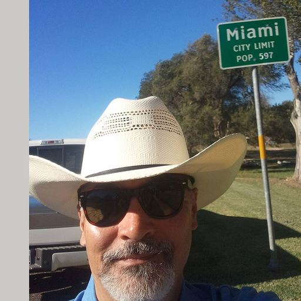

## Code Climate
[](https://codeclimate.com/github/Lambda-School-Labs/school-calendar-fe/maintainability)

[](https://codeclimate.com/github/Lambda-School-Labs/school-calendar-fe/test_coverage)

# School Calendar
d8picker.com


## :one:  Developers and Designers
~ DeAndre Johnson ~

Github Handle: https://github.com/drejohnson

~ Jeremy McWilliams ~

Github handle: https://github.com/J2Macwilliams

~ Daniel Stadler ~

Github handle: https://github.com/dstadz

~ Mark French ~

Github handle: https://github.com/juarezfrench

~ Kenneth Austin ~

Github handle: https://github.com/Kennethaustin

~ Andrew Ogle ~

Github handle: https://github.com/andrewogle
## :three: Project Overview

:memo: [Trello Board](https://https://trello.com/b/DsQe2Rf5/school-calendar-main)

:memo: [Product Canvas](https://www.notion.so/School-Calendar-4f6d59c69ed5456c9b78174ac6292e00)

School Calendar was an app idea brought to Lambda from a school coach. The coach would like a calendar that he could update with various events and push to a larger source i.e. google, outlook, or Ical.

Along with these things notifying changes to a schedule the coach would like to update things inside the events such as time and location. The last key feature would be event templates that can be placed in bulk across unrelated days.


## 4️⃣ Key Features

-    Users authentication
-    Create, Edit, and Delete calendars
-    Create, Edit, and Delete simple events
-    Display upcoming events
-    Handle Re-Occuring Events


## :five: Tech Stack

### Front End built using:

#### React

-    Provides good code bases for things like calendars.
-    Group knowledge of it.
-    Hooks makes things more simple.
-    Context API provides state-management and seemlessly intergrates with browser's local storage

### Material-UI

-   Integrates seemlessly with React
-   Provides custom and overiding styles to match the design color pallete

#### Front end deployed to `Netlify`

-   Makes it easy to rapidly deploy code by connection Netlify and Github

### Back End build using

#### Node.JS

-   Provides an easy way to implement code following MVC model
-   Knex JS allows simple and flexible query-building
-   API routes are implemented using Express.
  

## :six: Environment Variables

In order for the app to function correctly, the user must set up their own environment variables. These variables are stored securely on Heroku.

REACT_APP_GOOGLE_CLIENT_ID
REACT_APP_GOOGLE_API_KEY
REACT_APP_BASE_URL
REACT_APP_ENDPOINT_URL
FRONTEND_URL
BASE_URL
SESSION_SECRET 
GOOGLE_CLIENT_REDIRECT
GOOGLE_CLIENT_SECRET
GOOGLE_CLIENT_ID
DB_CONNECT=MONGODB

## :seven: Open Questions ❓

-   What if a users want to use their Google credential to log into the application?
-   Can the application push existing calendars and/or events to a user's Google calendar or Apple Calendar?
-   How can an calendar creator restrict access to the calendar subscribers.  For example, a subscriber may view the event but can not edit or delete the event.
-   What are some ways for a user to get notify of a new events?
-   Imagine a calendar is full of events, how to can a user search for an interested event? Should the search algorithm be built from scratch or using existing third-party service such as Algolia.


## :eight: Installation Instructions

With this project Yarn was used for the frontend and NPM was used for the backend. The Dependancies are as followed; ```"@chakra-ui/core": "^0.5.2",
  "@emotion/core": "^10.0.27", "@emotion/styled": "^10.0.27", "@material-ui/core": "^4.9.1", "axios": "^0.19.2", "dayjs": "^1.8.20", "dotenv": "^8.2.0", "emotion-theming": "^10.0.27", "googleapis": "47.0.0", "history": "^4.10.1", "react": "^16.12.0", "react-dom": "^16.12.0", "react-ga": "^2.7.0", "react-hook-form": "^4.8.2", "react-router-dom": "^5.1.2", "react-scripts": "3.3.1"```

## Other Scripts

    "start": "react-scripts start",
    "build": "react-scripts build",
    "test": "react-scripts test",
    "eject": "react-scripts eject"


## :one: :zero: Contributing

When contributing to this repository, please first discuss the change you wish to make via issue, email, or any other method with the owners of this repository before making a change.

Please note we have a [code of conduct](./CODE_OF_CONDUCT.md). Please follow it in all your interactions with the project.

## :one: :one: Issue/Bug Request
   
 **If you are having an issue with the existing project code, please submit a bug report under the following guidelines:**
 - Check first to see if your issue has already been reported.
 - Check to see if the issue has recently been fixed by attempting to reproduce the issue using the latest master branch in the repository.
 - Create a live example of the problem.
 - Submit a detailed bug report including your environment & browser, steps to reproduce the issue, actual and expected outcomes,  where you believe the issue is originating from, and any potential solutions you have considered.

## :one: :two: Feature Requests

We would love to hear from you about new features which would improve this app and further the aims of our project. Please provide as much detail and information as possible to show us why you think your new feature should be implemented.

## :one: :three: Pull Requests

If you have developed a patch, bug fix, or new feature that would improve this app, please submit a pull request. It is best to communicate your ideas with the developers first before investing a great deal of time into a pull request to ensure that it will mesh smoothly with the project.

Remember that this project is licensed under the MIT license, and by submitting a pull request, you agree that your work will be, too.

## :one: :four: Pull Request Guidelines

- Ensure any install or build dependencies are removed before the end of the layer when doing a build.
- Update the README.md with details of changes to the interface, including new plist variables, exposed ports, useful file locations and container parameters.
- Ensure that your code conforms to our existing code conventions and test coverage.
- Include the relevant issue number, if applicable.
- You may merge the Pull Request in once you have the sign-off of two other developers, or if you do not have permission to do that, you may request the second reviewer to merge it for you.

## :one: :five: Attribution

These contribution guidelines have been adapted from [this good-Contributing.md-template](https://gist.github.com/PurpleBooth/b24679402957c63ec426).

## :one: :six: Documentation

See [Backend Documentation]https://github.com/Lambda-School-Labs/school-calendar-be for details on the backend of our project.
